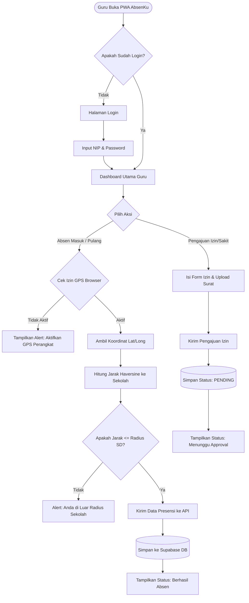
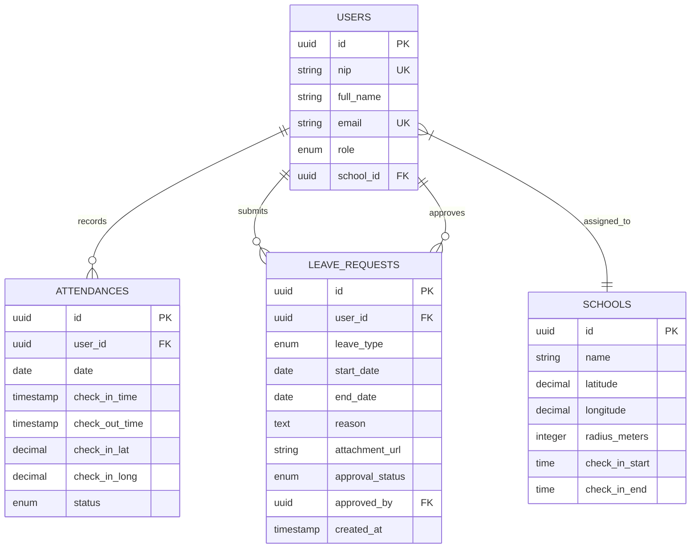

# Product Requirement Document (PRD): AbsenKu

**Document Status:** Approved / Draft  
**Author:** Senior Technical Product Manager & Principal Software Engineer  
**Target Platform:** Web App / PWA (Next.js & Supabase)  
**Version:** 1.0.0  
**Date:** August 9, 2026  

---

## 1. Overview

### 1.1 Executive Summary
**AbsenKu** adalah aplikasi kehadiran dan manajemen izin berbasis Web Application / Progressive Web App (PWA) yang dirancang khusus untuk Tenaga Pendidik (Guru) di Sekolah Dasar (SD). Aplikasi ini menyelesaikan permasalahan ketidakakuratan data kehadiran dan proses perizinan manual dengan memanfaatkan teknologi **Geolocation (GPS / Geofencing)** sebagai verifikasi utama (tanpa verifikasi selfie/foto). Berbasis arsitektur **Next.js (App Router)**, **shadcn/ui**, dan **Supabase (PostgreSQL, GoTrue Auth, Realtime, Storage)**, AbsenKu menawarkan solusi yang cepat, aman, efisien, dan dapat diakses dengan mudah dari perangkat seluler guru tanpa perlu menginstal aplikasi native dari App Store / Play Store.

### 1.2 Problem Statement & Goals
* **Problem Statement:**
  1. **Kecurangan Kehadiran (Titip Absen):** Metode presensi manual atau berbasis kertas rawan manipulated data lokasi dan waktu.
  2. **Proses Izin yang Tidak Terstruktur:** Pengajuan izin/sakit masih menggunakan pesan instan (WhatsApp) atau surat fisik yang sering hilang dan tidak terdata secara terpusat untuk pelaporan sekolah.
  3. **Efisiensi Operasional:** Kepala Sekolah dan Admin TU membutuhkan waktu lama untuk merekap data kehadiran bulanan sebagai dasar tunjangan/kinerja.

* **Product Goals:**
  1. Menyediakan sistem absensi *real-time* berbasis lokasi presisi (Geofencing radius SD).
  2. Memdigitalisasi dan mengotomatisasi alur pengajuan serta persetujuan izin/sakit.
  3. Menyediakan dashboard rekapitulasi kehadiran otomatis bagi Admin TU dan Kepala Sekolah.

* **Key Success Metrics / KPIs:**
  * **Location Accuracy Rate:** $\ge 98\%$ absensi terverifikasi tepat dalam radius geofence sekolah.
  * **System Adoption Rate:** $\ge 95\%$ guru aktif menggunakan AbsenKu dalam 1 bulan pertama peluncuran.
  * **Time-to-Check-in:** Rata-rata waktu proses absen masuk/pulang $\le 5$ detik.
  * **Administrative Efficiency:** Pengurangan waktu rekap absensi bulanan dari 3-5 hari menjadi $< 10$ menit (Otomatis).
  * **Uptime / SLA:** Availability sistem $99.9\%$.

### 1.3 Scope & Out-of-Scope
* **In-Scope:**
  * Autentikasi Pengguna (Login/Logout, Role-based Access Control: Admin/Kepala Sekolah vs Guru).
  * Manajemen Profil & Radius Sekolah (Geofencing Koordinat Lat/Long + Radius Meter).
  * Absen Masuk & Absen Pulang berbasis Geofencing GPS.
  * Modul Pengajuan Izin/Sakit + Lampiran Dokumen Surat Dokter/Keterangan.
  * Modul Approval Izin oleh Kepala Sekolah / Admin TU.
  * Dashboard Rekapitulasi & Export Laporan (PDF & Excel/XLSX).
  * Support PWA (Offline detection, Installable Prompt, Push Notification via Supabase / Web Push).

* **Out-of-Scope (Phase 1):**
  * Integrasi Hardware RFID/Fingerprint fisik.
  * Penggajian / Payroll Automation (hanya menyediakan export data absensi).
  * Pemantauan kelas via Kamera CCTV *real-time*.

---

## 2. Requirements

### 2.1 Functional Requirements

#### A. Modul Autentikasi & Manajemen Pengguna
* **FR-AUTH-01:** Sistem harus mendukung login berbasis Email/NIP dan Password menggunakan Supabase Auth (GoTrue).
* **FR-AUTH-02:** Sistem harus mendukung Role-Based Access Control (RBAC) dengan role: `ADMIN_TU`, `KEPALA_SEKOLAH`, dan `GURU`.
* **FR-AUTH-03:** Sistem harus menyimpan sesi login secara aman dengan JWT (JSON Web Token) dan HttpOnly Cookies.

#### B. Modul Geofencing & Absensi (Core)
* **FR-ABS-01:** Sistem wajib mengambil koordinat GPS perangkat guru saat melakukan presensi (Masuk & Pulang).
* **FR-ABS-02:** Sistem wajib memvalidasi apakah koordinat guru berada di dalam radius geofence sekolah (misal: max 50 meter dari titik pusat SD).
* **FR-ABS-03:** Sistem wajib menampilkan indikator status lokasi real-time (jarak guru terhadap titik pusat sekolah dan radius geofence) pada dashboard sebelum guru menekan tombol presensi.
* **FR-ABS-04:** Sistem harus menolak absensi jika lokasi GPS dimatikan, mock location detected, atau berada di luar radius geofence.
* **FR-ABS-05:** Sistem harus mencatat timestamp absensi secara otomatis berdasarkan waktu server (UTC/WIB) untuk mencegah manipulasi jam lokal perangkat.

#### C. Modul Perizinan & Sakit
* **FR-IZN-01:** Guru dapat mengajukan izin/sakit dengan melengkapi form: Jenis Izin, Tanggal Mulai, Tanggal Selesai, Alasan, dan Unggah Foto Surat Dokter/Keterangan.
* **FR-IZN-02:** Admin/Kepala Sekolah menerima notifikasi pengajuan izin dan dapat menyetujui (`APPROVED`) atau menolak (`REJECTED`) disertai catatan.
* **FR-IZN-03:** Status izin yang disetujui otomatis mengupdate status kehadiran guru pada tanggal terkait.

#### D. Modul Dashboard & Rekapitulasi
* **FR-REP-01:** Admin/Kepala Sekolah dapat melihat dashboard rekap harian (Hadir, Izin, Sakit, Alpa, Terlambat).
* **FR-REP-02:** Admin dapat mengunduh rekapitulasi absensi bulanan dalam format Excel (.xlsx) dan PDF per individu atau per seluruh guru.

---

### 2.2 Non-Functional Requirements

* **Performance:**
  * Time to First Byte (TTFB) $< 300	ext{ ms}$.
  * First Contentful Paint (FCP) $< 1.2	ext{ detik}$.
  * API response time untuk presensi $< 1	ext{ detik}$.
* **Security:**
  * Seluruh komunikasi wajib melalui HTTPS / TLS 1.3.
  * Penerapan Row Level Security (RLS) di Supabase PostgreSQL untuk menjamin isolasi data antar role.
  * Validasi server-side strict untuk koordinat GPS.
  * Anti-Spoofing: Deteksi Mock Location via HTML5 Geolocation Browser API flags.
* **Scalability:**
  * Arsitektur Serverless Next.js di Vercel + Supabase Managed PostgreSQL yang dapat auto-scale menampung lonjakan traffic pada jam masuk sekolah (06.30 - 07.30 WIB).
* **Availability / SLA:**
  * System Availability minimum **99.9%** per bulan.
  * PWA Service Worker caching untuk asset statis agar aplikasi tetap terbuka meski koneksi internet terputus/lambat.

---

## 3. Core Features & Acceptance Criteria (MoSCoW)

| Feature ID | Nama Fitur | Deskripsi | Prioritas (MoSCoW) |
|---|---|---|---|
| **FEAT-01** | Geofenced Check-In / Out | Presensi masuk & pulang berdasarkan lokasi radius SD | **Must Have** |
| **FEAT-02** | Leave & Sick Request | Form pengajuan izin/sakit beserta upload bukti dokumen | **Must Have** |
| **FEAT-03** | Approval System | Interface Admin/Kepala Sekolah untuk menyetujui/menolak izin | **Must Have** |
| **FEAT-04** | Presence History & Status | Riwayat absensi harian dan status bulanan bagi Guru | **Must Have** |
| **FEAT-05** | Monthly Recaps & Export | Dashboard rekap absensi & fitur export Excel/PDF | **Should Have** |
| **FEAT-06** | PWA Installation & Offline Shell | Dukungan pendaftaran PWA Service Worker & Install Prompt | **Should Have** |
| **FEAT-07** | Push Notification | Notifikasi ingatan absen & status pengajuan izin | **Could Have** |

---

### Acceptance Criteria (Given-When-Then)

#### Scenario 1: Absen Masuk Berhasil (Happy Path)
* **Given:** Guru sudah login, berada di dalam radius 30 meter dari lokasi SD, dan GPS perangkat aktif.
* **When:** Guru membuka halaman Presensi dan menekan tombol "Absen Masuk".
* **Then:** Sistem memverifikasi koordinat GPS, mencatat data presensi dengan timestamp server, menampilkan toast notification "Absen Masuk Berhasil", dan memperbarui status hari ini menjadi "Hadir".

#### Scenario 2: Absen Masuk Gagal - Di Luar Radius Sekolah (Edge Case)
* **Given:** Guru berada di luar area radius SD (misal: jarak 150 meter dari koordinat sekolah).
* **When:** Guru menekan tombol "Absen Masuk".
* **Then:** Sistem menolak permintaan, menampilkan pesan error "Gagal Presensi: Anda berada di luar radius lokasi SD (Jarak Anda: 150m)", dan data presensi tidak tersimpan.

#### Scenario 3: Pengajuan Izin dengan Lampiran Dokumen
* **Given:** Guru tidak dapat hadir karena sakit dan membuka menu "Pengajuan Izin".
* **When:** Guru memilih tipe "Sakit", memasukkan rentang tanggal, mengunggah foto surat dokter, lalu menekan "Kirim Pengajuan".
* **Then:** File terunggah ke Supabase Storage, status pengajuan tersimpan sebagai `PENDING`, dan Kepala Sekolah menerima notifikasi/item baru di daftar antrean approval.

---

## 4. User Flow



---

## 5. System Architecture

```
+-----------------------------------------------------------------------+
|                            CLIENT LAYER                               |
|   Progressive Web App (Next.js React Client / Tailwind CSS / shadcn/ui / Lucide) |
|   - HTML5 Geolocation API                                             |
|   - Service Workers (PWA & Offline Caching)                           |
+-----------------------------------+-----------------------------------+
                                    |
                                    | HTTPS / REST / WebSockets
                                    v
+-----------------------------------------------------------------------+
|                         APPLICATION LAYER                             |
|                   Next.js App Router (Vercel)                         |
|   - Server Components & Server Actions                                |
|   - API Routes / Middleware (Authentication & Rate Limiting)          |
|   - Distance Calculator Engine (Haversine Formula)                    |
+-----------------------------------+-----------------------------------+
                                    |
                                    | Native SDK / TLS
                                    v
+-----------------------------------------------------------------------+
|                          BACKEND & DATABASE                           |
|                        Supabase Cloud Platform                        |
|  +------------------+  +-------------------+  +--------------------+  |
|  |  Supabase Auth   |  | PostgreSQL Database|  |  Supabase Storage  |  |
|  |  (GoTrue JWT)    |  | (RLS Enabled)     |  | (Bucket Foto/Surat)|  |
|  +------------------+  +-------------------+  +--------------------+  |
+-----------------------------------------------------------------------+
```

### Infrastructure & Deployment Strategy
* **Frontend/Application Hosting:** Vercel Platform (Edge Network deployment untuk Next.js App Router).
* **Backend BaaS:** Supabase Cloud (Managed PostgreSQL Database, Auth, Storage).
* **Caching Strategy:** Next.js Data Cache + Stale-While-Revalidate (SWR) di sisi Client untuk riwayat absensi.
* **CI/CD:** GitHub Actions diintegrasikan ke Vercel Auto-Deployment pada branch `main`.

---

## 6. Sequence Diagram: Proses Absen Masuk (Core Scenario)

```mermaid
sequenceDiagram
    autonumber
    actor Guru
    participant PWA as PWA Client (Next.js)
    participant GPS as Browser Geolocation API
    participant NextServer as Next.js API Route
    participant SupabaseDB as Supabase Database

    Guru->>PWA: Klik Tombol "Absen Masuk"
    PWA->>GPS: Request Current Position ()
    GPS-->>PWA: Return Lat, Long, Accuracy
    PWA->>NextServer: POST /api/attendance/check-in (Lat, Long)
    
    activate NextServer
    NextServer->>SupabaseDB: Fetch School Location & Allowed Radius
    SupabaseDB-->>NextServer: Return Lat_Sekolah, Long_Sekolah, Radius_Meter
    
    Note over NextServer: Hitung Jarak Jarak(Lat/Long Guru, Lat/Long Sekolah)
menggunakan Haversine Formula

    alt Jarak > Radius_Meter
        NextServer-->>PWA: 400 Bad Request (Out of Geofence Range)
        PWA-->>Guru: Tampilkan Error "Di Luar Radius Sekolah"
    else Jarak <= Radius_Meter
        NextServer->>SupabaseDB: INSERT into attendances (user_id, timestamp, status, location)
        SupabaseDB-->>NextServer: 201 Created Status
        
        NextServer-->>PWA: 200 OK (Presensi Berhasil)
        PWA-->>Guru: Tampilkan Toast "Absen Masuk Berhasil"
    end
    deactivate NextServer
```

---

## 7. Database Schema

### 7.1 Entity Relationship Diagram (ERD)



### 7.2 SQL DDL (PostgreSQL / Supabase Schema)

```sql
-- Enable UUID Extension
CREATE EXTENSION IF NOT EXISTS "uuid-ossp";

-- Enum Types
CREATE TYPE user_role AS ENUM ('ADMIN_TU', 'KEPALA_SEKOLAH', 'GURU');
CREATE TYPE attendance_status AS ENUM ('HADIR', 'TERLAMBAT', 'IZIN', 'SAKIT', 'ALPA');
CREATE TYPE leave_type AS ENUM ('IZIN', 'SAKIT', 'CUTI');
CREATE TYPE approval_status AS ENUM ('PENDING', 'APPROVED', 'REJECTED');

-- Table: Schools
CREATE TABLE schools (
    id UUID PRIMARY KEY DEFAULT uuid_generate_v4(),
    name VARCHAR(255) NOT NULL,
    latitude DECIMAL(10, 8) NOT NULL,
    longitude DECIMAL(11, 8) NOT NULL,
    radius_meters INT NOT NULL DEFAULT 50,
    check_in_start TIME NOT NULL DEFAULT '06:00:00',
    check_in_end TIME NOT NULL DEFAULT '07:30:00',
    created_at TIMESTAMP WITH TIME ZONE DEFAULT CURRENT_TIMESTAMP
);

-- Table: Users (Profiles mapped to Supabase auth.users)
CREATE TABLE users (
    id UUID PRIMARY KEY REFERENCES auth.users(id) ON DELETE CASCADE,
    nip VARCHAR(50) UNIQUE NOT NULL,
    full_name VARCHAR(255) NOT NULL,
    email VARCHAR(255) UNIQUE NOT NULL,
    role user_role NOT NULL DEFAULT 'GURU',
    school_id UUID REFERENCES schools(id) ON DELETE SET NULL,
    created_at TIMESTAMP WITH TIME ZONE DEFAULT CURRENT_TIMESTAMP
);

-- Table: Attendances
CREATE TABLE attendances (
    id UUID PRIMARY KEY DEFAULT uuid_generate_v4(),
    user_id UUID NOT NULL REFERENCES users(id) ON DELETE CASCADE,
    date DATE NOT NULL DEFAULT CURRENT_DATE,
    check_in_time TIMESTAMP WITH TIME ZONE,
    check_out_time TIMESTAMP WITH TIME ZONE,
    check_in_lat DECIMAL(10, 8),
    check_in_long DECIMAL(11, 8),
    status attendance_status NOT NULL DEFAULT 'HADIR',
    created_at TIMESTAMP WITH TIME ZONE DEFAULT CURRENT_TIMESTAMP,
    CONSTRAINT unique_user_date UNIQUE (user_id, date)
);

-- Table: Leave Requests
CREATE TABLE leave_requests (
    id UUID PRIMARY KEY DEFAULT uuid_generate_v4(),
    user_id UUID NOT NULL REFERENCES users(id) ON DELETE CASCADE,
    type leave_type NOT NULL,
    start_date DATE NOT NULL,
    end_date DATE NOT NULL,
    reason TEXT NOT NULL,
    attachment_url TEXT,
    status approval_status NOT NULL DEFAULT 'PENDING',
    approved_by UUID REFERENCES users(id) ON DELETE SET NULL,
    created_at TIMESTAMP WITH TIME ZONE DEFAULT CURRENT_TIMESTAMP
);

-- Row Level Security (RLS) Policies
ALTER TABLE attendances ENABLE ROW LEVEL SECURITY;

-- Guru hanya bisa membaca data absensi miliknya sendiri
CREATE POLICY "Users can view own attendances" ON attendances
    FOR SELECT USING (auth.uid() = user_id);

-- Admin & Kepsek bisa membaca seluruh data absensi
CREATE POLICY "Admins can view all attendances" ON attendances
    FOR SELECT USING (
        EXISTS (
            SELECT 1 FROM users 
            WHERE id = auth.uid() AND role IN ('ADMIN_TU', 'KEPALA_SEKOLAH')
        )
    );
```

---

## 8. Tech Stack & Architectural Justification

| Components | Tech Stack Selected | Justification / Rationale |
|---|---|---|
| **Frontend Framework** | **Next.js 14+ (App Router)** | Rendering ultra-cepat dengan Server Components, SEO friendly, built-in API Routes, dan kemudahan integrasi PWA. |
| **Styling & UI Components** | **Tailwind CSS + shadcn/ui (terinstal)** | Komponen UI yang dapat dikustomisasi dengan cepat, ringan, responsif, dan ramah pengguna seluler (mobile-first); sudah terintegrasi di project ini (`components/ui`). |
| **Backend & BaaS** | **Supabase** | Menyediakan PostgreSQL terkelola, sistem Auth bawaan (GoTrue), Storage untuk dokumen izin, dan RLS untuk keamanan data. |
| **Database** | **PostgreSQL (via Supabase)** | Relational Database yang sangat andal, mendukung constraint unik, indexing, serta ekstensi spasial/geografis jika dibutuhkan. |
| **Storage** | **Supabase Storage** | Penyimpanan file terintegrasi dengan akses terenkripsi dan kebijakan RLS untuk menyimpan dokumen izin. |
| **Authentication** | **Supabase Auth (JWT)** | Menangani manajemen session, enkripsi password, dan enkapsulasi JWT secara aman out-of-the-box. |
| **DevOps & Hosting** | **Vercel** | Platform deployment terdistribusi global yang terintegrasi secara *native* dengan repo GitHub dan Next.js. |

---